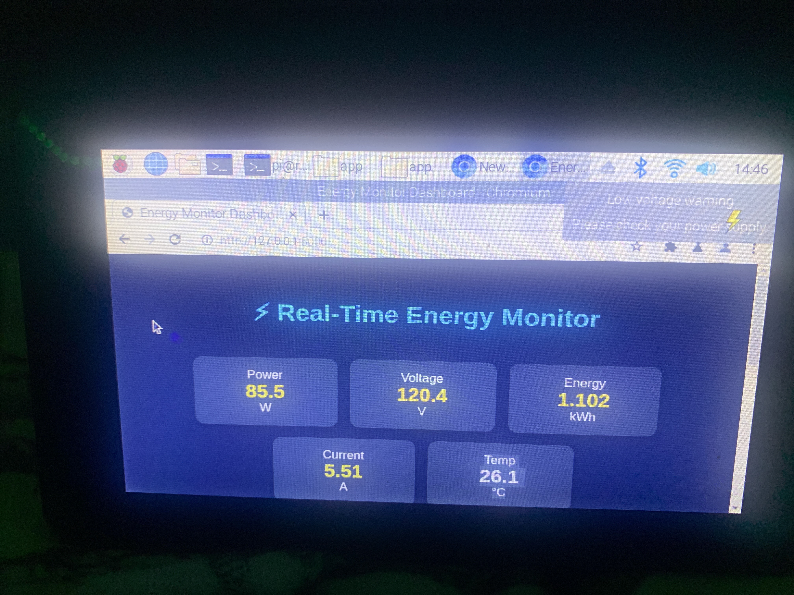
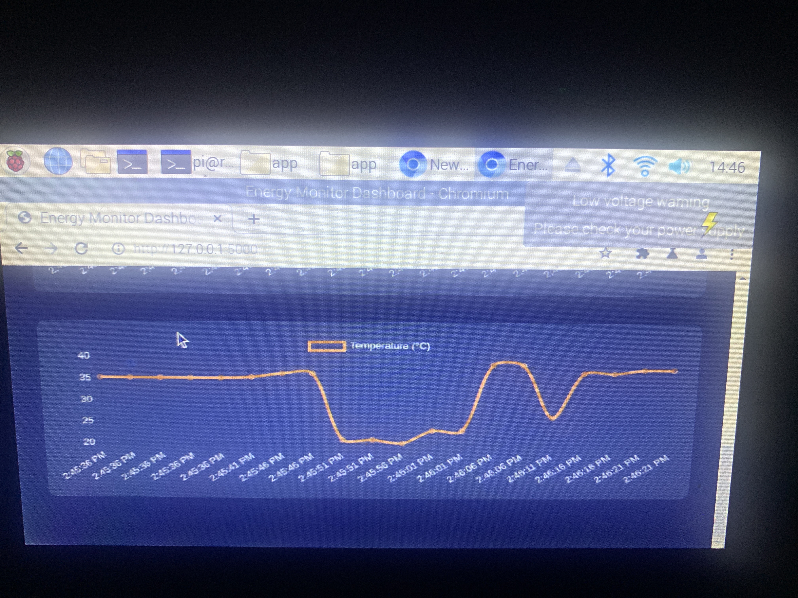
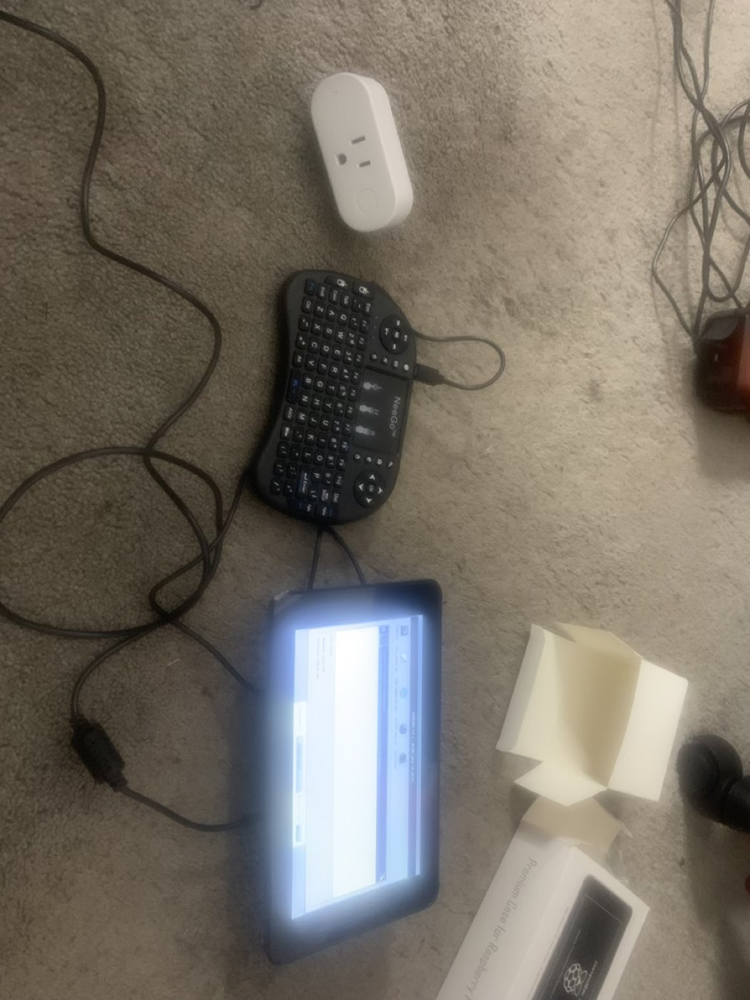

# Real Time Energy Monitoring System

## Project Overview
A smart energy monitoring system with real-time dashboard, device integration, and data logging.

## Architecture
Device → MQTT → Flask Service → SQLite → Dashboard

## Tech Stack
- Python
- Flask
- Paho MQTT
- SQLite
- JavaScript
- Raspberry Pi

## Setup Instructions
```sh
git clone https://github.com/DareeInn/Real-Time-Energy-Monitoring-System.git
cd Real-Time-Energy-Monitoring-System
pip install -r requirements.txt
python run.py
```

## 📸 Screenshots

### Dashboard


### Graph


### Hardware Setup


### Live Code


### Running System

